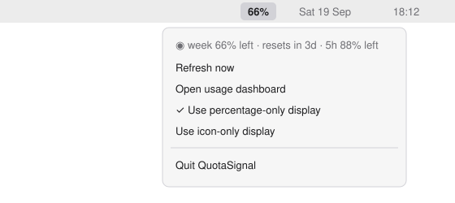

<div align="center">

# ◉ QuotaSignal

**Your shared ChatGPT and Codex quota, in the menu bar.**

QuotaSignal reads your quota from the local Codex app server once a minute.
It shows the weekly allowance remaining in the macOS menu bar or Windows tray.
Notifications arrive when the remaining quota crosses 50%, 20%, and 10%.

[](https://github.com/Tatendaz/QuotaSignal/actions/workflows/ci.yml)
[](LICENSE)
[](pyproject.toml)
[](#limits)

</div>

A live quota check on macOS returned:

```text
$ quotasignal --check
check passed: ◉ week 94% left · resets in 6d
```

<picture><source media="(prefers-color-scheme: dark)" srcset="docs/images/menu-dark.svg"></picture>

The menu image is an illustration. The command output above is from a real quota read.

## Install

Requires Python 3.10+ and the [Codex CLI](https://developers.openai.com/codex/cli), signed in to your ChatGPT account. QuotaSignal is free; your ChatGPT subscription is separate. No API key is required. The command line uses Python's standard library; the desktop indicator installs platform-specific GUI dependencies.

1. Clone the repository:
   ```bash
   git clone https://github.com/Tatendaz/QuotaSignal.git
   cd QuotaSignal
   ```
2. Create an environment and install the app:
   ```bash
   python3 -m venv .venv
   source .venv/bin/activate
   python -m pip install ".[menu]"
   ```
3. Check access, then start the indicator:
   ```bash
   quotasignal --check
   quotasignal tray
   ```

On Windows, use `py -m venv .venv` and `.venv\Scripts\Activate.ps1`. For startup at login, run `./scripts/install-macos.sh` or `.\scripts\install-windows.ps1`. See [installation details](docs/install.md).

## Use it

```bash
quotasignal             # weekly quota and reset time
quotasignal --compact   # Q 94%
quotasignal --json      # sanitized snapshot
quotasignal --fresh     # bypass the 60-second CLI cache
quotasignal tray        # menu bar or system tray
```

The menu includes the 5-hour window when available, a refresh action, and display options. A `~` means the last cached value is shown after a read fails. [Configure notifications and paths](docs/configuration.md).

## How it works

<picture><source media="(prefers-color-scheme: dark)" srcset="docs/diagrams/quota-flow-dark.svg"></picture>

QuotaSignal starts `codex app-server`, requests `account/rateLimits/read` over stdio, and displays the result. Codex owns the signed-in session. [Diagram source and regeneration](docs/diagrams/README.md).

## What leaves your machine

QuotaSignal makes no network requests of its own and has no telemetry. It asks the local Codex CLI for quota data; Codex communicates with OpenAI using your existing ChatGPT login. QuotaSignal does not read authentication files or need its own key.

The quota cache at `~/.cache/quotasignal/usage.json` holds percentages, reset timestamps, and a plan label. `~/.config/quotasignal/` holds display preferences and notification state. No account identifiers are written to the quota cache or JSON output. These paths can be moved with `XDG_CONFIG_HOME` and `XDG_CACHE_HOME`.

Choose **Quit QuotaSignal** on macOS or **Quit** on Windows to stop polling. Set `notifications.enabled` to `false` in the configuration to stop notifications. [Data and credential promises](SECURITY.md).

## Limits

- macOS tray behavior has been used on Apple silicon. Windows tests run in CI; the real Windows tray and installers still need hardware verification.
- Linux supports the command line only.
- The Codex app-server API is experimental and can change between CLI releases.
- Quota availability depends on the Codex CLI and your account. API-key-only setups may have no subscription quota.
- Crowded macOS menu bars can hide the item; Windows may put it in the overflow area.
- Desktop builds are unsigned. The optional icon comes from an installed OpenAI desktop app and is not bundled here.

## Documentation

| Page | Contents |
| --- | --- |
| [Install](docs/install.md) | Login startup, migration, removal |
| [Configuration](docs/configuration.md) | Notifications, paths, display modes |
| [Architecture](docs/diagrams/README.md) | Diagram source and regeneration |
| [Contributing](CONTRIBUTING.md) | Setup, checks, PR rules |
| [Changelog](CHANGELOG.md) | Version history |
| [Review](docs/review.md) | Automated checks and review limits |
| [Roadmap](ROADMAP.md) | Remaining platform work |

## Uninstall

For login installs, run `./scripts/uninstall-macos.sh` or `.\scripts\uninstall-windows.ps1`. For a manual install, quit the app and run `python -m pip uninstall quotasignal` in its environment. Config and cache files remain until you delete them. [Removal details](docs/install.md).

[Contributing](CONTRIBUTING.md) · [Security](SECURITY.md) · [MIT license](LICENSE) © Tatenda Zhou · Not affiliated with OpenAI.
